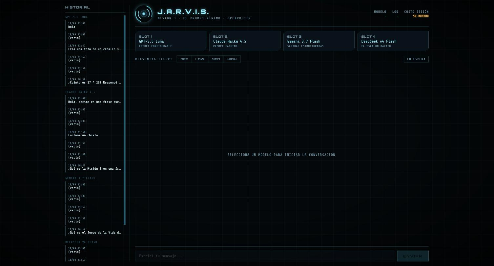
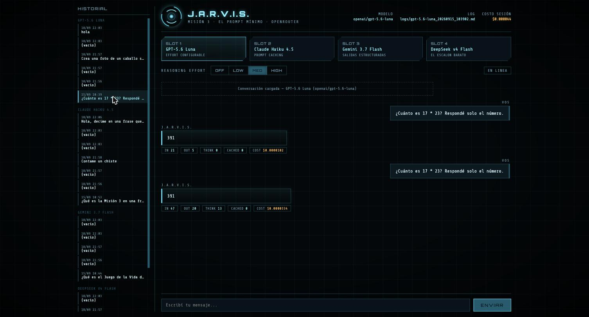
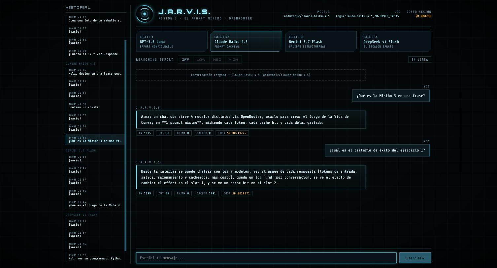
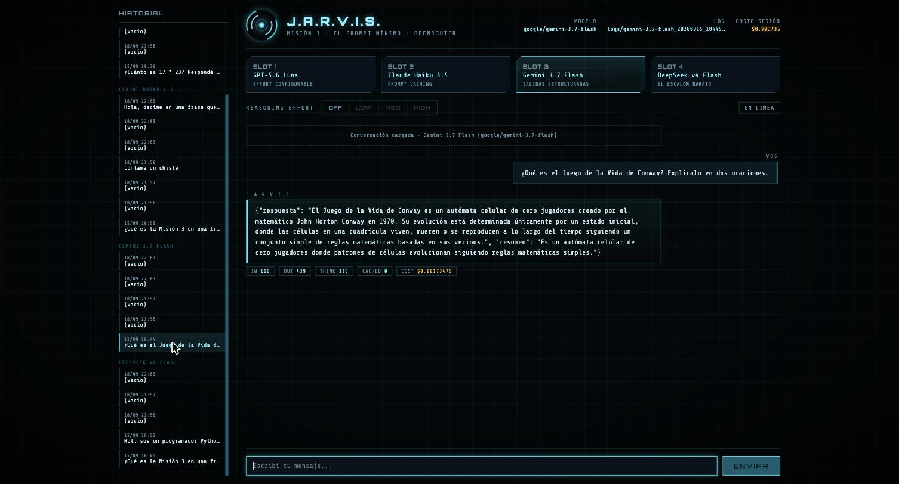

# Misión 3 — El prompt mínimo

Interfaz de chat propia sobre [OpenRouter](https://openrouter.ai) (`chat.py`, estilo
J.A.R.V.I.S.), usada para resolver el Juego de la Vida de Conway en el mínimo de
prompts posible, con auditoría completa de tokens y costo por respuesta. Enunciado
completo en `mission.md`, criterios de corrección en `rubric.md`.



## Estructura del repo

| Archivo / carpeta | Qué es |
|---|---|
| `chat.py` | Server web (Flask) de la interfaz de chat sobre OpenRouter (ejercicio 1) |
| `core.py` | Lógica de OpenRouter compartida: modelos, llamadas a la API, usage, logs |
| `static/` | Frontend de la interfaz (HTML/CSS/JS), estética J.A.R.V.I.S. |
| `logs/` | Un log `.md` por conversación real con la interfaz, evidencia de auditoría |
| `vida.py` | Solución al Juego de la Vida de Conway, generada por chat (ejercicio 2) |
| `test_vida.py` | Script de testing de la cátedra — no se toca |
| `exploracion.md` | Exploración previa obligatoria del ejercicio 3 (precios, contexto, benchmarks) |
| `informe_ejercicio3.md` | Informe final del ejercicio 3 |
| `mission.md` | Enunciado completo de la misión |
| `rubric.md` | Cómo se corrige |
| `SPEC.md` | Estado actual de cada ejercicio frente a lo pedido en `mission.md` |
| `CLAUDE.md` / `AGENTS.md` | Instrucciones para trabajar en este repo con una IA de programación |

## Cómo correr el chat

```bash
cp .env.example .env   # completar OPENROUTER_API_KEY, requiere credito cargado
pip3 install -r requirements.txt
python3 chat.py
```

Abre un server local en `http://127.0.0.1:5000` (o el puerto de la variable de entorno
`PORT`, si está definida — útil para desplegar en plataformas que lo asignan
dinámicamente). Desde el navegador:

- Elegí uno de los 4 slots de modelo para arrancar una conversación nueva (con su propio log).
- El toggle de `REASONING EFFORT` ajusta el esfuerzo de razonamiento del modelo activo.
- Cada respuesta muestra su usage (input/output/reasoning/cached/cost) debajo del mensaje.
- El panel de **HISTORIAL** a la izquierda lista todas las conversaciones guardadas en
  `logs/`, agrupadas por modelo. Hacer click en una las recarga completas (con su usage
  por turno) y permite seguir chateando: los mensajes nuevos se agregan al mismo log en
  vez de crear uno nuevo.

Sirve 4 modelos, cada uno pensado para ejercitar una capacidad distinta de la API (ver
`SPEC.md` para el detalle): reasoning effort, prompt caching, salidas estructuradas y un
modelo barato para comparar costo.

### Capacidades en acción

Capturas reales tomadas desde el panel de **HISTORIAL**, cargando logs ya guardados en
`logs/` — los números de usage son los que realmente devolvió OpenRouter.

| | |
|---|---|
| <br>**Slot 1 — Reasoning effort**<br>Misma pregunta con `effort=low` (`THINK 0`) y con `effort=high` (`THINK 13`): se ve el costo extra de pensar más. | <br>**Slot 2 — Prompt caching**<br>Primer turno con `CACHED 0` (miss, escribe el bloque cacheado); segundo turno con `CACHED 5491` (hit real), el costo cae de $0.0072 a $0.0011. |
| <br>**Slot 3 — Salidas estructuradas**<br>Toda respuesta se fuerza a JSON Schema (`respuesta` + `resumen`) vía `response_format`. | |

## Cómo correr los tests de Conway

```bash
python3 test_vida.py ruta/a/vida.py
```

## Estado

Ver `SPEC.md` para el detalle completo. Los 3 ejercicios están completos: ejercicio 1
(interfaz + logs de evidencia en `logs/`), ejercicio 2 (`vida.py`, generado en 1 solo
prompt, pasa los 9 tests) y ejercicio 3 (informe en `informe_ejercicio3.md`).
